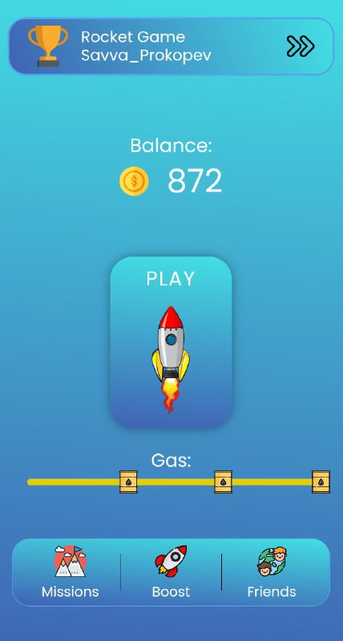
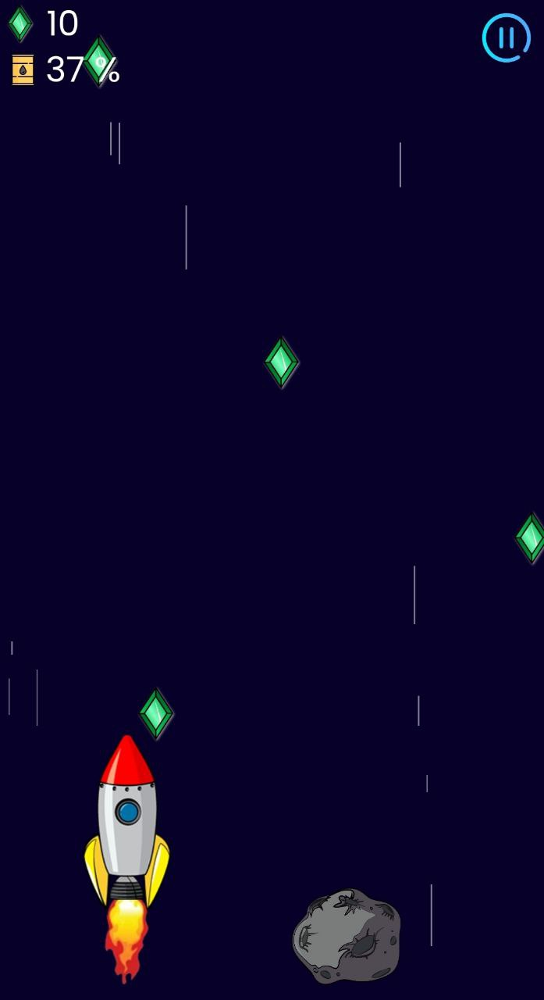

# 
Rocket game

  
   

---

### Description
Embark on an adventure in our Telegram mini-app game, where you pilot a rocket through space to collect valuable coins. Enjoy stunning visuals and immersive gameplay in this cosmic journey. Work only from phone.
[https://t.me/rocket_game_tg_bot](https://t.me/rocket_game_tg_bot) 

### About the project
The project is implemented using three microservices (auth, game, users). One of the services operates on gRPC. The gateway is implemented using KrakenD. 

### Stack:
- Go
- Gin
- Docker
- Redis
- PostgreSQL
- gRPC
- KrakenD
- Prometheus/Grafana
- Swagger
---

